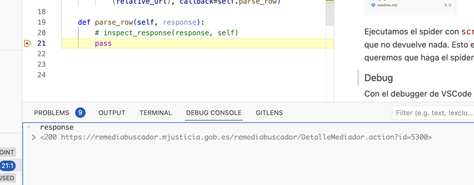

# Scraping de Remediabuscador

## Creación del proyecto

Creamos una nueva carpeta ejecutando el comando `mkdir remediabuscador` y nos movemos a ella con `cd remediabuscador`.

Creamos un entorno virtual con `python3 -m venv .e` y lo activamos con `source .e/bin/activate` o `. .e/bin/activate`.

A partir de ahora podemos instalar las librerías que necesitaremos, y estarán aisladas en este entorno virtual, sin afectar a las librerías del sistema.

La principal que usaremos para hacer scraping es [Scrapy](https://scrapy.org/), que instalamos con `pip install scrapy`.


### Scraping de API o del contenido de HTML

Hay varios tipos de scraping. En unos scrapeamos directamente el contenido de la web que vemos. En otros, como en este caso, scrapeamos los datos que nos devuelve la API que usa la web para obtener los datos.

En los casos en que el contenido se renderiza a través de una API, veríamos llamadas en la consola de la web a una API, y esas llamadas son las que vamos a replicar.


Si viéramos alguna llamada en esta parte, significaría que el contenido se renderiza via Javascript llamando a una API externa. Pero no es así, parece que el contenido se renderiza en HTML directamente si desactivamos la el filtro Fetch/XHR (que muestra solo llamadas a APIs).


### Primer test para ver si la web permite scraping
Hay muchos mecanismos por los que las webs nos pueden bloquear, y formas de pasar esos bloqueos.

La forma más básica de scraping es hacer una llamada a la web con Python para descargar el contenido. Esto lo podemos hacer con el comando `scrapy shell '<URL>'`. En este caso, la URL sería `https://remediabuscador.mjusticia.gob.es/remediabuscador/buscarRegistroMediador.action?busquedaAux=true`


Cuando hacemos un request, uno de los datos que devuelve el servidor es el status code. Si es 200, significa que la petición ha ido bien. Si es 403, significa que el servidor nos ha bloqueado, por ejemplo. 

Como vemos aquí, el status code es 200, así que podemos seguir adelante sin usar ningún otro método para evitar bloqueos.


### Trabajo previo:
- [ ] Ver vídeo sobre consola del navegador para inspeccionar elementos


### Creación del spider con Scrapy
Crearemos un nuevo proyecto ejecutando `scrapy startproject remedia`.
Luego entramos en la carpeta del proyecto con `cd remedia` y generamos un spider con `scrapy genspider remedia https://remediabuscador.mjusticia.gob.es/`.

Veremos un nuevo archivo en la carpeta `spiders` con el nombre `remedia.py`. Este archivo es el que contiene el código que usaremos para hacer scraping.


Ejecutamos el spider con `scrapy crawl remedia` y vemos que no devuelve nada. Esto es porque no hemos definido qué queremos que haga el spider.

### Anti-bloqueos básico
- Caching
- Proxies

#### Añadir .env
Instalar la librería `dotenv` con `pip install python-dotenv` y crear un archivo `.env` con el siguiente contenido:

```
LUMINATI_PROXY=...
```

Añadir proxies en el spider.


### Debug

Con el debugger de VSCode podemos ver qué está pasando en cada momento. Para ello, añadimos un breakpoint en la línea 10 del archivo `remedia.py` y ejecutamos el spider con el comando `scrapy crawl remedia`.


Podemos ver en https://docs.scrapy.org/en/latest/topics/debug.html#visual-studio-code cómo configurar el debugger de VSCode para que funcione con Scrapy.


### Añadir función para parsear un mediador


### ChatGPT
