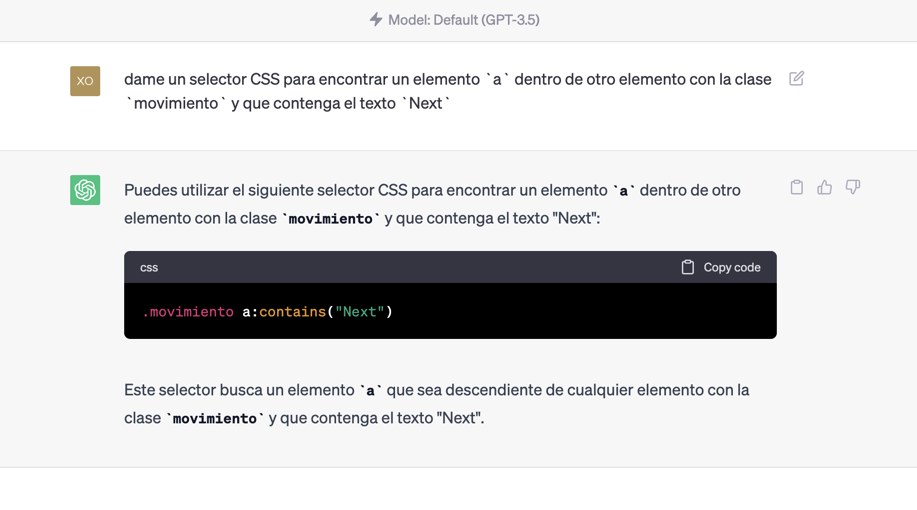
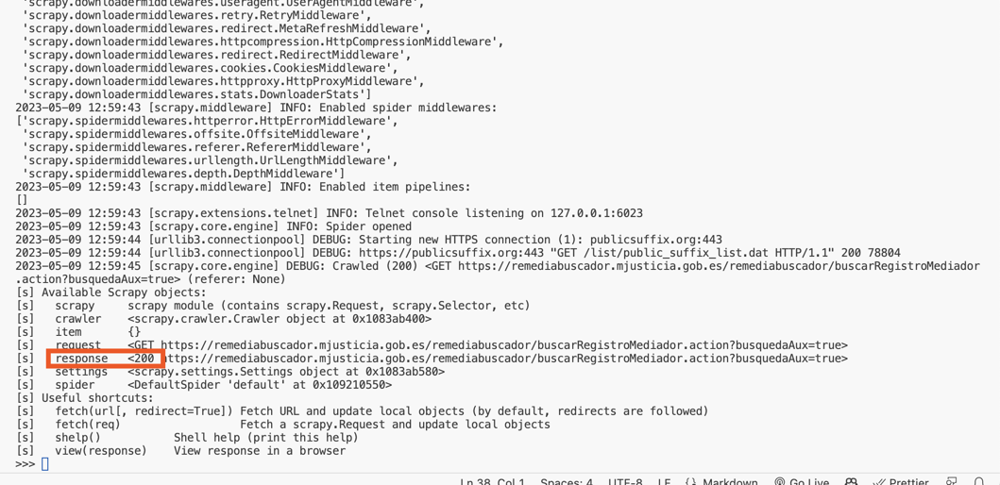

# Scraping de Remediabuscador


## Abrir herramientas de dessarrollador de Chrome

Lo abrimos haciendo click derecho - inspeccionar, o con Control + Shift + C, o cmd+shift+c en mac

## Scraping con https://www.webscraper.io/

Usaremos un plugin de Chrome, [Webscraper](https://www.webscraper.io/). Hay muchos, este es gratis y nos permite scrapear una cantidad ilimitada de páginas ejecutándolo desde nuestro ordenador. Si queremos usar la versión cloud habría que pagar, pero para nuestro caso no nos hace falta.

[Este vídeo](https://www.youtube.com/watch?v=n7fob_XVsbY) es un buen resumen de cómo usarlo.

Seguiremos estos pasos, tras haberlo instalado:

### Crear un nuevo Sitemap. 

En start url ponemos la primera web por la que empezará el scraping. Esta: https://remediabuscador.mjusticia.gob.es/remediabuscador/avanzarRetrocederRegistroMediador.action?paginacion.index=1&nombre=&especialidad=0&area=


### Estructura del scraper
Haremos un scraper que hará, básicamente:
1. Encontrar todos los links de mediadores en una web
   1. Entrar en cada link de cada mediador y guardar la info de cada mediador: nombre, email, descripción, dirección, especialidad y área
2. Avanzar a la siguiente página y hacer lo mismo

### Paginación

Empezaremos por la parte de la paginación, donde el scraper irá de página en página haciendo click en el link de **Siguiente**

Nos iremos a Selectors, y ahí creamos un nuevo selector:


En la sección de Data preview, pondremos el selector CSS para encontrar un elemento `a` dentro de otro elemento con la clase `movimiento` y que contenga el texto `Next`. Esto lo podemos hacer de forma visual con la herramienta **Select** del plugin, pero en este caso nos daría un selector CSS incorrecto, que cuando hay un botón **Siguiente** y uno **Anterior**, seleccionaría los dos (`.movimiento a`)


Aunque no sepamos de selectores CSS, ChatGPT sí sabe:



Copiamos ese código en la sección indicada, y guardamos el selector


Veremos esto


Es importante que seleccionemos en el dropdown de type la opción **Pagination**. En Pagination type, el tipo lo dejamos en **auto**. Hay otros tipos disponibles pero en este caso no son necesarios.

### Encontrar los links de cada mediador

Hacemos click en ese selector, y veremos una vista como esta, pero sin ver el selector mediadorLink (este será el que vamos a crear ahora)


Ahora crearemos un nuevo selector. Es importante que verifiquemos que lo creamos estando dentro del selector next page, y no en `_root`.

Hacemos click en **Add new selector**.
Nombramos el nuevo selector `mediadorLink`. Hacemos click en **Select** y luego clickamos en dos de los nombres de los mediadores. Vemos que el plugin detecta otros links similares. Hacemos click en **Done selecting** y por último en la casilla **Multiple** para que el plugin sepa que hay varios de estos links y no navegue solo al primero.

Importante también marcar **Type** como **Link**

Guardamos el selector, y por último creamos el scraper para cada página individual de cada mediador

### Scrapear cada mediador.

Navegamos al link de cualquiera de los mediadores.

En la vista de selectores, hacemos click en **mediadorLink**. Vemos ahora que estamos en un tercer nivel


Ahora, crearemos un selector para cada campo que queramos guardar. Por ejemplo, para el de name sería así:


En este caso **Type** sería **Text**

El proceso es el mismo para todos los otros campos.


### Sitemap graph

Por último, para verificar que el scraper está bien, vamos a **Selectors > Selector graph** y deberíamos ver esto, después de hacer click en _root y next page (cuando se hace click en un selector, se muestran los selectores que dependen de él).


Vemos que si seguimos abriendo el selector de **next page** seguimos viendo lo mismo, un selector de next page y uno de mediadorLink, de forma recurrente.

### Ejecución del scraping

Por último, nos vamos a la sección **Scrape** del segundo desplegable (en nuestro caso se llama **Sitemap remedia** porque el  Sitemap que creamos se llama Remedia)


Veremos estas opciones. El valor mínimo para request interval son 2000 ms y el mínimo para Page load delay es 500. Esto quiere decir que por lo menos tardaremos 2.5s en escrapear cada página


Hacemos click en Start scraping y se nos abrirá una ventana nueva. Podemos volver a la ventana donde estábamos antes y en la sección **Browse** veremos los datos que se van scrapeando.


Con este plugin, el tiempo total será de unas 5-6 horas y no podemos acelerarlo ni personalizarlo. Si queremos más velocidad deberemos usar un lenguaje de programación para hacer el scraping, como Python.


## Scraping con Python

Creamos una nueva carpeta ejecutando el comando `mkdir remediabuscador` y nos movemos a ella con `cd remediabuscador`.

Creamos un entorno virtual con `python3 -m venv .e` y lo activamos con `source .e/bin/activate` o `. .e/bin/activate`.

A partir de ahora podemos instalar las librerías que necesitaremos, y estarán aisladas en este entorno virtual, sin afectar a las librerías del sistema.

La principal que usaremos para hacer scraping es [Scrapy](https://scrapy.org/), que instalamos con `pip install scrapy`.


### Scraping de API o del contenido de HTML

Hay varios tipos de scraping. En unos scrapeamos directamente el contenido de la web que vemos. En otros, como en este caso, scrapeamos los datos que nos devuelve la API que usa la web para obtener los datos.

En los casos en que el contenido se renderiza a través de una API, veríamos llamadas en la consola de la web a una API, y esas llamadas son las que vamos a replicar.


Si viéramos alguna llamada en esta parte, significaría que el contenido se renderiza via Javascript llamando a una API externa. Pero no es así, parece que el contenido se renderiza en HTML directamente si desactivamos la el filtro Fetch/XHR (que muestra solo llamadas a APIs).


### Primer test para ver si la web permite scraping
Hay muchos mecanismos por los que las webs nos pueden bloquear, y formas de pasar esos bloqueos.

La forma más básica de scraping es hacer una llamada a la web con Python para descargar el contenido. Esto lo podemos hacer con el comando `scrapy shell '<URL>'`. En este caso, la URL sería `https://remediabuscador.mjusticia.gob.es/remediabuscador/buscarRegistroMediador.action?busquedaAux=true`




Cuando hacemos un request, uno de los datos que devuelve el servidor es el status code. Si es 200, significa que la petición ha ido bien. Si es 403, significa que el servidor nos ha bloqueado, por ejemplo. 

Como vemos aquí, el status code es 200, así que podemos seguir adelante sin usar ningún otro método para evitar bloqueos.


### Creación del spider con Scrapy
Crearemos un nuevo proyecto ejecutando `scrapy startproject remedia`.
Luego entramos en la carpeta del proyecto con `cd remedia` y generamos un spider con `scrapy genspider remedia https://remediabuscador.mjusticia.gob.es/`.

Veremos un nuevo archivo en la carpeta `spiders` con el nombre `remedia.py`. Este archivo es el que contiene el código que usaremos para hacer scraping.


Ejecutamos el spider con `scrapy crawl remedia` y vemos que no devuelve nada. Esto es porque no hemos definido qué queremos que haga el spider.

### Anti-bloqueos básico

#### Caching
Con esto descargaremos las webs solo una vez y almacenaremos el resultado en el nuestro ordenador. Si hacemos la misma request al servidor, a veces seremos bloqueados y es poco 'polite' sobrecargar los servidores de forma innecesaria.

Esto lo conseguiremos con esta sección en `remedia.py`


```py
    custom_settings = {
        "HTTPCACHE_ENABLED": True,
        "HTTPCACHE_DIR": "httpcache",
        "HTTPCACHE_ALWAYS_STORE": True,  # TODO remove to get new data
        "HTTPCACHE_POLICY": "scrapers.scrapers.middlewares.CachePolicy",
    }
```

También deberemos añadir esto a `settings.py`

```py
DOWNLOADER_MIDDLEWARES = {
    "scrapy.downloadermiddlewares.httpcache.HttpCacheMiddleware": 300,
}
```

Y este código a `middlewares.py`, para cachear (guardar) solo los requests exitosos, que devuelven un código 200

```py
class CachePolicy(DummyPolicy):
    def should_cache_response(self, response, request):
        return response.status == 200
```

#### Proxies

Los proxies nos permiten que en vez de que el servidor reciba todos los requests desde nuestra IP, los reciba desde otras IPs. En mi caso usé BrighData y creé un proxy de IPs españolas. Esto hace que sea más difícil que nos bloqueen. Aunque no es necesario. 

Si queremos usar proxies, instalaremos la librería `dotenv` con `pip install python-dotenv` y crear un archivo `.env` con el siguiente contenido:

```
LUMINATI_PROXY=...
```

Esta librería nos permite cargar los archivos .env.

Los archivos .env los solemos usar para guardar información sensible, para no ponerla directamente en nuestro código. Los archivos .env se suelen excluir de sistemas de control de versiones como git añadiéndolos al archivo .gitignore. 

Por último, para hacer que scrapy use este proxy, lo conseguimos con esta parte del código:

```py
if proxy := os.getenv("LUMINATI_PROXY_PER_IP_spain_1"):
    meta = {"proxy": proxy}
else:
    meta = {}
```

Esta variable `meta` luego se le pasa a scrapy cuando hacemos un request, por ejemplo cuando hacemos `yield scrapy.Request(url=url, callback=self.parse, meta=meta)`


### Debug

Con el debugger de VSCode podemos ver qué está pasando en cada momento. Para ello, añadimos un breakpoint en la línea 10 del archivo `remedia.py` y ejecutamos el spider con el comando `scrapy crawl remedia`.


Podemos ver en https://docs.scrapy.org/en/latest/topics/debug.html#visual-studio-code cómo configurar el debugger de VSCode para que funcione con Scrapy.


### Función para escrapear cada página de lista de mediadores, y avanzar de página

Esto lo conseguimos con la función `parse`, definida así:

```py
    def parse(self, response):
        table = response.css("table.tabla_datos")[0]
        rows = table.css("tbody tr")
        for row in rows:
            columns = row.css("td")
            relative_url = columns[0].css("a::attr(href)").get()
            # relative_url is relative, and we need to pass the full url to the request. We do that with the response.urljoin method
            yield scrapy.Request(
                url=response.urljoin(relative_url),
                callback=self.parse_mediador,
                meta=meta,
            )
```

### Añadir función para parsear un mediador
Esto lo hacemos con la otra función que definimos en el código, llamada `parse_mediador`:

```py
    def parse_mediador(self, response):
        # inspect_response(response, self)
        paragraphs = response.css("div.detallePublicacion p")
        name = paragraphs[0].css("::text").getall()[-1][1:].strip()
        address = paragraphs[1].css("::text").getall()[-1][1:].strip()
        email = paragraphs[2].css("::text").getall()[-1][1:].strip()
        speciality = paragraphs[3].css("::text").getall()[-1][1:].strip()
        area = paragraphs[4].css("::text").getall()[-1][1:].strip()
        experience = paragraphs[5].css("::text").getall()[-1][1:].strip()
        mediador = {
            "name": name,
            "address": address,
            "email": email,
            "speciality": speciality,
            "area": area,
            "experience": experience,
            "mediador_link": response.urljoin(response.url),
        }
        yield mediador
```

### ChatGPT

Podemos usar ChatGPT para hacer cualquier pregunta que tengamos y suele ser bastante bueno. Por ejemplo, para generar el código para encontrar un cierto elemento


O para saber qué hace una función:


Esta es la respuesta completa de ChatGPT:

Esta función es un método llamado `parse` que se utiliza en el contexto de un spider de Scrapy. Scrapy es un framework de rastreo y extracción de datos en Python.

El propósito de esta función es analizar la respuesta recibida después de enviar una solicitud HTTP y extraer información específica de la página web.

Aquí está la explicación paso a paso de lo que hace la función:

1. `table = response.css("table.tabla_datos")[0]`: Selecciona el primer elemento de la página web que tenga la etiqueta `<table>` y la clase `tabla_datos` utilizando el selector CSS `table.tabla_datos`. Luego, almacena ese elemento en la variable `table`.

2. `rows = table.css("tbody tr")`: Selecciona todos los elementos `<tr>` que sean descendientes del elemento `table` y los almacena en la variable `rows`. Estos elementos representan las filas de la tabla.

3. `for row in rows:`: Inicia un bucle que itera sobre cada fila de la tabla.

4. `columns = row.css("td")`: Selecciona todos los elementos `<td>` que sean descendientes del elemento `row` (una fila de la tabla) y los almacena en la variable `columns`. Estos elementos representan las celdas de la fila.

5. `relative_url = columns[0].css("a::attr(href)").get()`: Selecciona el primer elemento `<a>` que sea descendiente de la primera celda de la fila (`columns[0]`). Luego, extrae el valor del atributo `href` del elemento `<a>`, que corresponde a una URL relativa. Esa URL relativa se almacena en la variable `relative_url`.

6. `yield scrapy.Request(url=response.urljoin(relative_url), callback=self.parse_mediador, meta=meta)`: Crea una nueva solicitud HTTP utilizando `scrapy.Request` para la URL completa, que se obtiene mediante `response.urljoin(relative_url)`. La solicitud utiliza una función de devolución de llamada llamada `parse_mediador` para procesar la respuesta de la nueva solicitud. Además, se puede pasar metadatos adicionales utilizando el parámetro `meta`. El `yield` indica que se está generando un objeto de tipo `Request` para que Scrapy lo maneje de manera asíncrona.

En resumen, esta función extrae las URL relativas de los enlaces encontrados en la primera columna de cada fila de una tabla HTML. Luego, genera nuevas solicitudes HTTP utilizando esas URL completas y las procesa con la función de devolución de llamada `parse_mediador`.